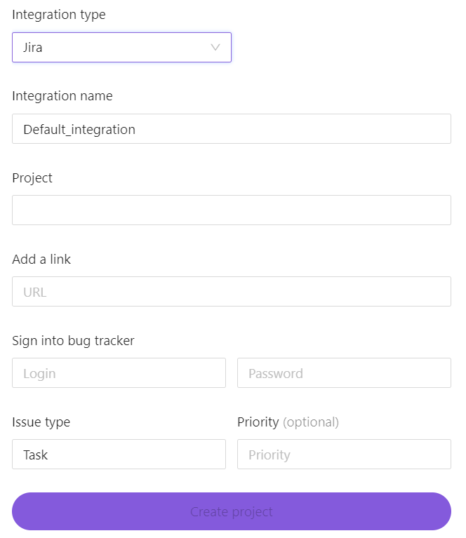
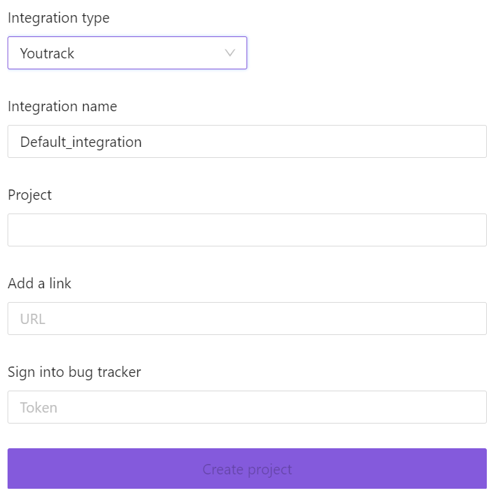

# Bug tracker integrations

BondiFuzz can be integrated with Jira and YouTrack task trackers.

When a fuzzing test suite detects a crash, an issue will be created in the task tracker.

## Issue tracking with Jira

To create a Jira integration, go to the `Integration` tab while editing a project and choose an integration type.  

To create an integration, you must have an existing project in Jira.

Priority and issue type should be assigned according to the priorities and types existing in the tracker.

After creating a project in BondiFuzz, load a fuzzing test suite and run it. If it detects a crash, an issue with a detailed description will be created in Jira. If the fuzzing test suite finds the duplicates of a crash, the issue will be automatically updated.

You can edit existing integrations. If you switch to a different project in Jira, the previously detected crashes and their duplicates will be aggregated in the old project. Only crashes will appear in the new one.

## YouTrack integration

When creating a project, choose YouTrack in the drop-down list of integration options.  

Before creating an integration, you have to create a project in YouTrack.

User identification is performed using the token generated in YouTrack.

You can edit an existing integration. Just like with Jira, when you switch YouTrack projects, detected crashes remain in the old project along with the information about duplicates. The new project will only have new crashes.