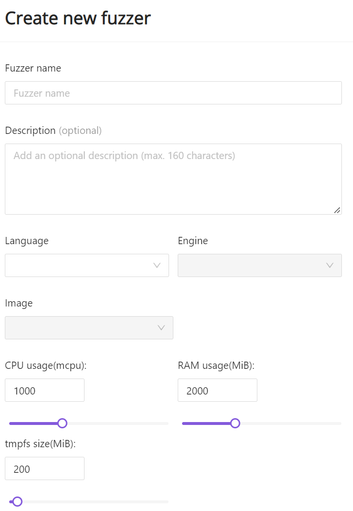

# Create a fuzzer

To create a Fuzzer, click `+Fuzzer` in the `Fuzzers` tab.

1. Enter the fuzzer's name  

The name must be unique

2. Fuzzer description is optional

3. Choose a programming language (currently, `Go`, `C++`, `Rust` and `Python` are supported)  

4. Choose the fuzzer type  

5. Choose an image (currently, only the administrator can upload images)  

6. Set CPU, RAM, and tmpfs values.

The CPU value is measured in mcpu and ranges from 500 to 2000.

The RAM value is measured in MiB and ranges from 500 to 5000.

The tmpfs value is measured in MiB and ranges from 100 to 2000.

7. Upload these files:

- the fuzzing test suite's binary
- seeds — input data for the fuzzing test suite (optional)
- config — file with additional options (optional)  

8. After it's uploaded, you can start, stop, and restart the fuzzer.  
  

Restart means clearing the fuzzing test suite's state, but the detected crashes, stats, and corpora are saved.

9. The following fuzzing test suite statuses exist:

- `Unverifying` — the fuzzing test suite has not loaded completely.
- `Verifying` — verification of the files uploaded to the farm.
- `Running` — the fuzzing test suite is running as expected.
- `Stopped` — the fuzzing test suite has been stopped.

fuzzing test suite states:

- `Ok` — the fuzzing test suite is working without errors.
- `Warning` — there are some issues with the fuzzing test suite.
- `Error` — an error that prevents the fuzzing test suite from working.

Possible fuzzing test suite combinations of states and statuses:

- `Unverifying Ok` — the fuzzing test suite's files are being loaded as expected.
- `Verifying Ok` — fuzzing test suite verification is in process.
- `Unverifying Error` — the user made erros in the cofig file, and the farm cannot read it.
- `Verifying Ok` — the confid file has been corrected and fuzzing test suite restarted.
- `Running Ok` — the fuzzing test suite is up and running.
- `Running Warning` — the fuzzing test suite has been working for a long time; supposedly, all errors has been found.
- `Stopped Warning` — the fuzzing test suite has been working for too long; there's no need for it to be running anymore.

By hovering over `Warning` and `Error`, you will see a description of the issue.

10. Adding a new fuzzing test suite version

When you are adding a new version of a fuzzing test suite, you do not have to modify the one already running in `BondiFuzz`. You can add a new version. This allows comparing  the results of all uploaded versions of a fuzzing test suite. Click `+ Add version` in the top right-hand corner of `Fuzzers` to add a version.

A version name is generated automatically based on the date and time. This name can be changed, and the description is optional.  

You can run just one version of a fuzzing test suite; versions of different fuzzing test suites can be running simultaneously.
