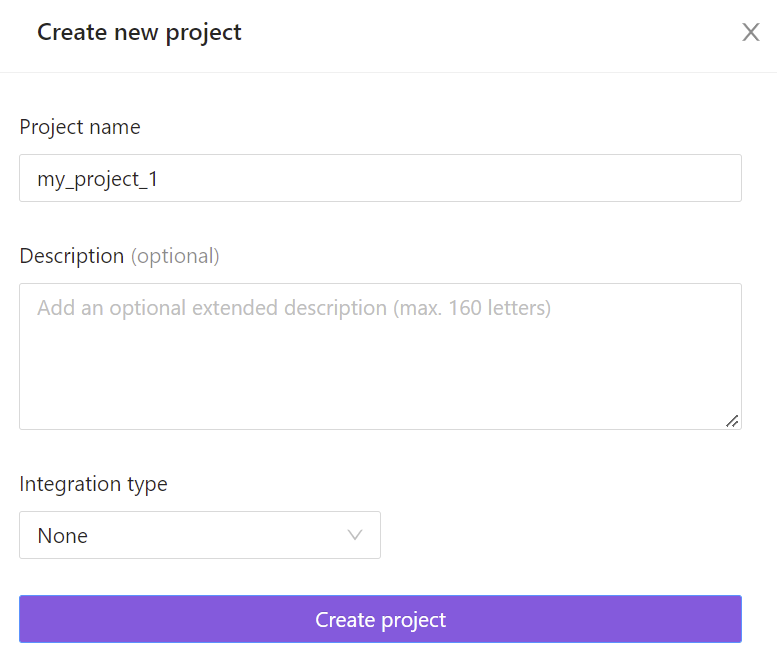

# Create a project

1. In the Projects tab, click `Add a new project`.

2. Enter a project name.  

The project name has to be unique.

3. Project description is optional

4. Provide the number of nodes and CPU and RAM values.

The CPU value is measured as the number of cores and can be: 2,4,6,8,10,12,14,16,20,24,28,32,36,40,44,48,52,56,60,64,68,72,76,80,84,88,92,96.

The RAM value is measured in GiB and is equal to the CPU value times a coefficient of 1 to 16 but cannot be more than 640 GiB.

5. If you need to integrate it with a task tracker, you can choose it in the drop-down list. You can create an integration for an existing project by clicking `Edit` and going to `Integrations`.
