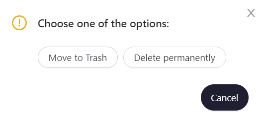

# Delete a fuzzer

To delete a fuzzer, go to `Fuzzers`, choose a fuzzer, and click `Delete`. 

In the pop-up window, choose one of the actions:  

- `Move to Trash` — fuzzer will be moved to the trash and kept there for 30 days, during which it can be recovered.

- `Delete Permanently` — fuzzer will be deleted without options to recover it.

A fuzzing test suite's version can be recovered from trash within 30 days after deletion. Go to `Trash`, choose a fuzzing test suite that you want to restore, choose a version and click `Restore`. You will see a notification saying `Version is restoring`, where you can cancel fuzzing test suite recovery.

You can also delete a fuzzing test suite's version from the trash completely by clicking `Delete`. On the notification saying `Version is permanently deleted`, you can click `Cancel`, to reverse this action and keep the version in the trash.

You can also delete all versions of a fuzzing test suite from the trash. In the `Trash` tab, click `Delete` and confirm.

You can permanently delete all fuzzing test suite versions related to a project. Go to `Trash`, click `Empty project bin` and confirm.
