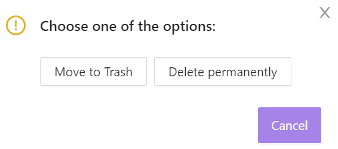

# Delete a project

You can delete a project by clicking `Delete`.

Choose one of the actions in the pop-up window:  

- `Move to Trash`: the project will be stored in Trash for 30 days, and it can be recovered. After that period, it will be deleted permanently.

Click `Cancel` on `Project is being deleted`, to cancel the operation.

You can find deleted project in the `Deleted` tab.

You can restore a deleted project by clicking `Restore`.

`Delete Permanently` delets the project permanently; the project cannot be restored.

The user can remove all projects from the bin by clicking `Empty user bin`.  

You can cancel these actions by clicking `Cancel` on the notification. Deleted projects cannot be restored.
