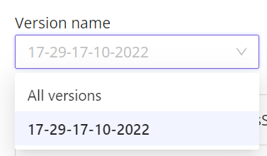
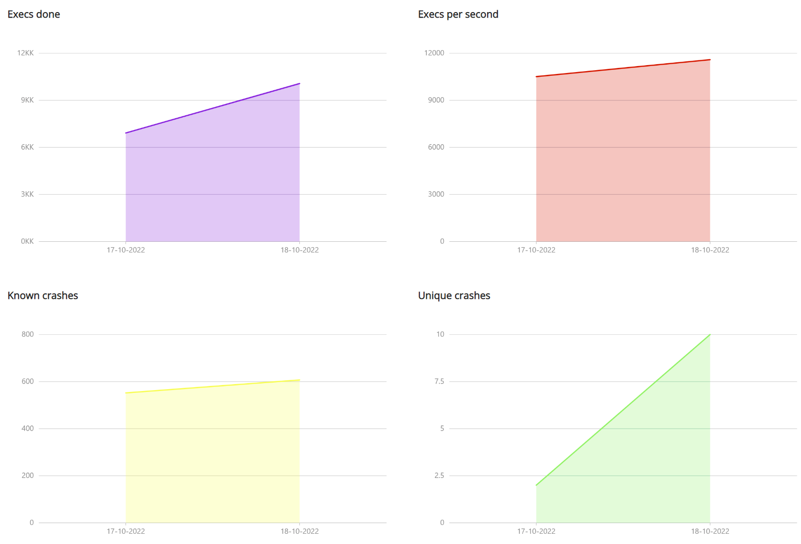

# Fuzzing test suite results

Once a fuzzing test suite was launched, crashes will begin to appear in the `Crashes` tab.

A user can view the list of all crashes or choose the crashes related to a certain fuzzing test suite version.  

BondiFuzz collects the statistics based on fuzzing test suite results.

In `Statistics`, you can see four diagrams.  

Here's how to read them:

- `Execs done` — total number of executions for a fuzzing test suite or fuzzing test suite's version;
- `Execs per second` — number of executions per second for a fuzzing test suite or fuzzing test suite's version;
- `Known crashes` — total number of crash duplicates;
- `Unique crashes` — total number of unique crashes.

User can view the statistics for a fuzzing test suite or a fuzzing test suite's version and choose a time period to display statistics for.  
