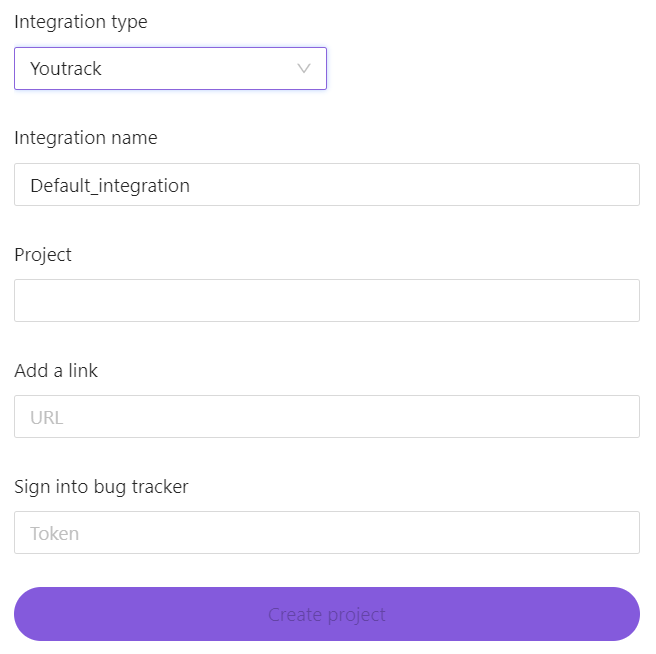

# Интеграция с баг-трекерами

BondiFuzz предполагает возможность интеграции с трекерами Jira и YouTrack.

При обнаружении фаззинг-тестом крэша будет создаваться issue в трекере.

## Интеграция с трекером задач Jira

Для интеграции с Jira при создании проекта необходимо в выпадающем списке выбрать необходимый тип интеграции.  

Перед созданием интеграции необходимо создать проект в трекере задач.

Приоритет и тип issue задаются пользователем в соответствии с приоритетами и типами, которые есть в трекере.

После создания проекта в BondiFuzz необходимо загрузить фаззинг-тест и запустить его. В случае, если фаззинг-тест обнаружит крэш, в Jira будет создано issue с подробным описанием. Если фаззинг-тест найдет дубликаты крэша, то issue изменится автоматически.

Есть возможность редактирования ранее созданной интеграции. При смене Jira-проекта крэши, которые уже были обнаружены фаззинг-тестом, останутся в старом проекте и там же будет информация о дубликатах крэшей. В новом проекте будут только новые крэши.

## Интеграция с трекером задач YouTrack

Для интеграции с YouTrack при создании проекта необходимо в выпадающем списке выбрать необходимый тип интеграции.  

Перед созданием интеграции необходимо создать проект в трекере задач.

Идентификация пользователя происходит по токену, создаваемому в YouTrack-е.

Есть возможность редактирования ранее созданной интеграции. Также как и с Jira, при смене YouTrack-проекта крэши, которые уже были обнаружены фаззинг-тестом, останутся в старом проекте и там же будет информация о дубликатах крэшей. В новом проекте будут только новые крэши.
