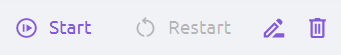
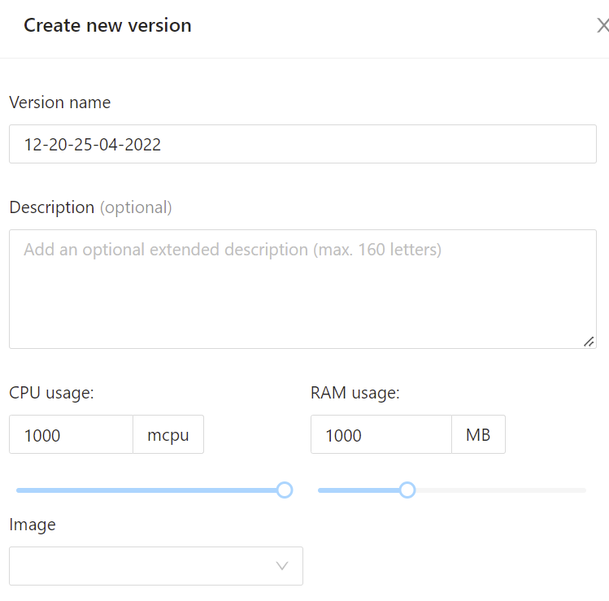

# Создание фаззера

Для создания фаззера во вкладке Fuzzers нажмите кнопку `+Fuzzer`.

1. Введите название фаззера.  

Название должно быть уникальным.

2. Описание фаззера опционально.

3. Выберите язык программирования, на данный момент доступны `Go`, `C++`, `Rust` и `Python`.  

4. Выберите тип фаззера.  

5. Выберите образ (на данный момент образы может загружать только администратор, есть возможность создать запрос на необходимый образ).  

6. Установите значения CPU, RAM и tmpfs (максимальные значения приведены для проекта по-умолчанию, в собственных проектах они могут отличаться).

Значение CPU измеряется в mcpu и может быть от 500 до 2000.

Значение RAM измеряется в MiB и может быть от 500 до 5000.

Значение tmpfs измеряется в MiB и может быть от 100 до 2000.

7. Загрузите следующие файлы:

- бинарный файл фаззинг-теста;
- сиды — набор входных данных для фаззинг-теста (не является обязательным);
- конфигурационный файл — файл с дополнительными опциями (не является обязательным).  

8. После загрузки фаззинг-тест можно запускать, останавливать и перезапускать.  
  

Перезапуск фаззинг-теста означает обнуление его состояния, но при этом собранные им креши, статистика и корпуса сохраняются.

9. Статусы фаззинг-теста могу быть следующие:

- `Unverifying` — фаззинг-тест еще не загрузился полностью.
- `Verifying` — проверка загруженных файлов.
- `Running` — фаззинг-тест запущен и работает в штатном режиме.
- `Interrupted` — фаззинг-тест остановлен из-за ошибок в работе.
- `Stopped` — фаззинг-тест остановлен.

Возможные состояния фаззинг-теста:

- `Ok` — фаззинг-тест работает без ошибок.
- `Warning` — предупреждение о том, что есть неполадки в работе фаззинг-теста.
- `Error` — ошибка в работе фаззинг-теста, из-за которой он не может дальше работать.

Возможные сочетания статусов и состояний:

- `Unverifying Ok` — файлы фаззинг-теста загружаются в штатном режиме.
- `Verifying Ok` — проверка фаззинг-теста идет в штатном режиме.
- `Unverifying Error` — пользователь неправильно написал конфигурационный файл, BondiFuzz не может распознать его содержимое.
- `Verifying Ok` — статус и состояние фаззинг-теста после исправления конфигурационного файла и перезапуска.
- `Running Ok` — фаззинг-тест запущен и работает.
- `Running Warning` — фаззинг-тест долго работал, предполагается, что уже обнаружены все возможные ошибки.
- `Stopped Warning` — фаззинг-тест слишком долго работал, дальнейшая трата ресурсов на его работу не имеет смысла.

При наведении курсора на `Warning` и `Error` выводится описание возникшей проблемы.

10. Добавление новой версии фаззинг-теста.

Для обновления фаззинг-теста не обязательно изменять тот, который уже был запущен в `BondiFuzz`. Можно добавить новую версию фаззинг-теста. Также это позволит сравнить результаты работы всех загруженных версий одного фаззинг-теста. Для этого во вкладке `Fuzzers` в правом верхнем углу нажмите кнопку `Add version`.

Название версии формируется автоматически — по времени и дате ее создания. Это название можно изменить, описание опционально.  

В одном фаззере может быть запущена только одна версия фаззинг-теста. Версии разных фаззинг-тестов могут быть запущены одновременно.
