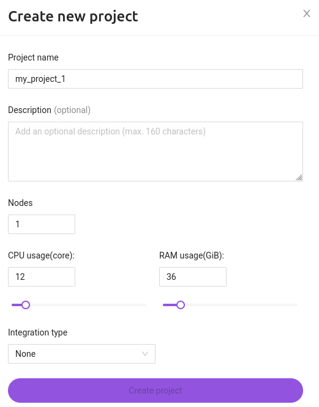

# Создание проекта

1. Во вкладке `Projects` нажмите `Add a new project`.

2. Введите название проекта.  

Название проекта должно быть уникальным.

3. Описание проекта опционально.

4. Укажите количество нод, количество CPU и размер памяти.

Значение CPU в проекте измеряется в количестве ядер, и может принимать следующие значения: 2, 4, 6, 8, 10, 12, 14, 16, 20, 24, 28, 32, 36, 40, 44, 48, 52, 56, 60, 64, 68, 72, 76, 80, 84, 88, 92, 96 (зависит от ограничений облачной платформы).

Значение RAM в проекте измеряется в GiB и равно значению CPU, умноженному на коэффициенты от 1 до 16, но не может быть более 640 GiB.

5. В случае, если необходима интеграция с трекером задач, выберите подходящий в выпадающем списке. Интеграцию можно создать для уже имеющегося проекта нажав кнопку `Edit` и перейдя во вкладку `Integrations`.
