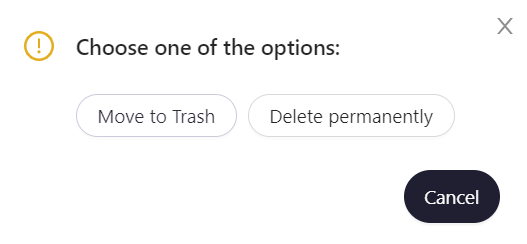

# Удаление фаззера

Чтобы удалить фаззер, перейдите во вкладку `Fuzzers`, выберите необходимый фаззер и нажмите кнопку `Delete`. 

На всплывающем окне необходимо выбрать одно из действий:  

- `Move to Trash` — перенести фаззер в корзину, где он будет находиться 30 дней c возможностью восстановления, после чего будет удален полностью.

Можно нажать `Cancel` на уведомлении `Version sent to trash`, чтобы отменить удаление.

- `Delete Permanently` — удалить полностью, без возможности восстановления.

Пока уведомление `Version is permanently deleted` видно, вы можете нажать `Cancel`, чтобы отменить удаление.

Удаление версий фаззинг-тестов происходит аналогично.

Версию фаззинг-теста, перемещенную в корзину, можно восстановить в течение 30 дней. Для этого необходимо перейти во вкладку `Trash`, слева выбрать версию фаззинг-теста, которую необходимо восстановить, навести курсор и нажать `Restore`. Появится уведомление `Version is restoring`, предоставляющее возможность отменить восстановление из корзины.

Также можно полностью удалить версию из корзины без возможности восстановления нажав кнопку `Delete`. На появившемся уведомлении `Version is permanently deleted` можно нажать `Cancel`, чтобы отменить удаление, и версия останется в корзине.

Помимо удаления отдельных версий фаззинг-тестов из корзины, есть возможность удалить навсегда версии, относящиеся к одному фаззеру.

Можно навсегда удалить все версии фаззеров, относящиеся к определенному проекту. Для этого необходимо перейти во вкладку `Trash`, нажать `Empty project bin` и подтвердить свое действие.
