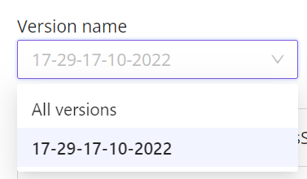
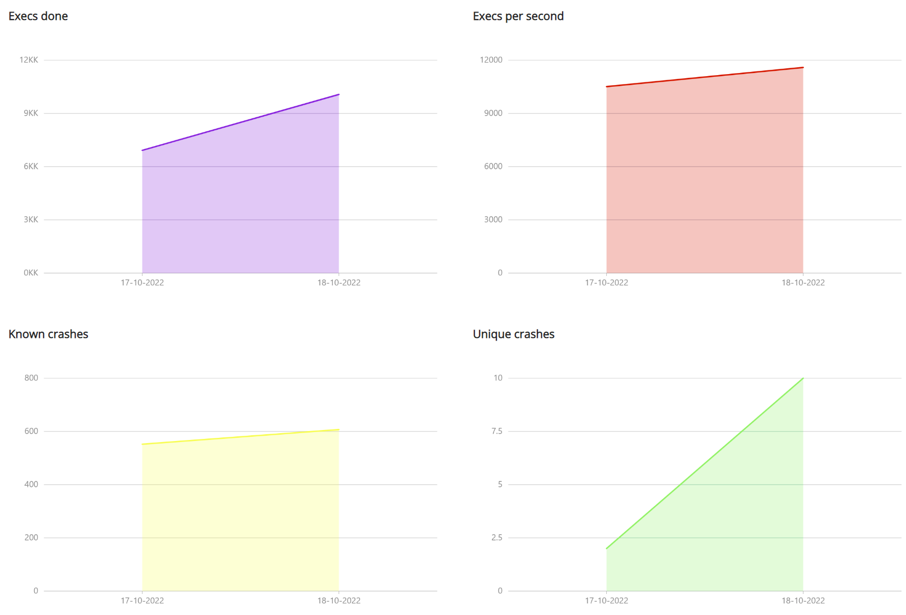
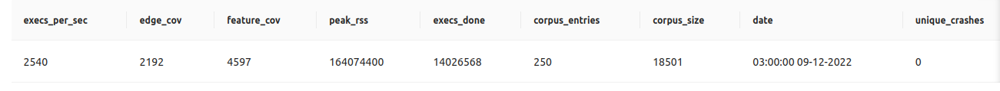
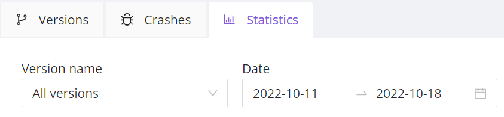

# Результаты работы фаззинг-тестов

Спустя некоторое время после запуска фаззинг-теста начинают появляться крэши во вкладке `Crashes`.

Пользователь может посмотреть общий список крэшей, а также выбрать крэши, относящиеся только к одной версии фаззинг-теста.  

BondiFuzz также собирает статистику по результатам работы фаззинг-тестов. 

Во вкладке `Statistics` можно увидеть четыре графика.  

Каждый из графиков имеет свое назначение:

- `Execs done` — количество запусков фаззинг-тестов;
- `Execs per second` — количество запусков фаззинг-тестов в секунду;
- `Known crashes` — общее количество дубликатов крэшей;
- `Unique crashes` — количество уникальных крэшей.

Другой вариант представления результатов работы фаззинг-теста — таблица.  

Статистику можно посмотреть как в целом для всех фаззинг-тестов, так и для отдельных версий, и выбрать интересующий временной промежуток.  

